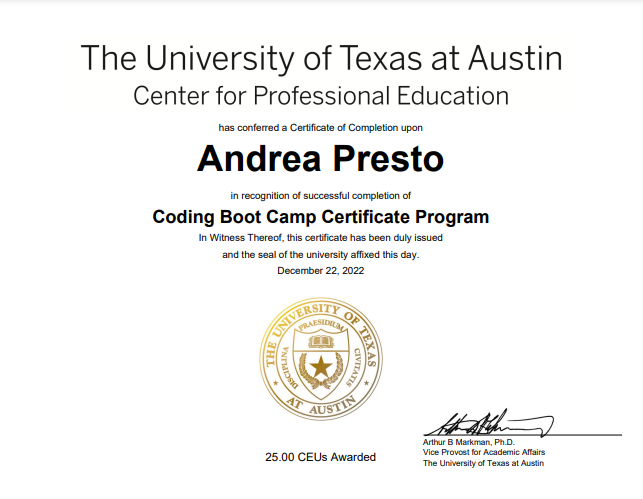
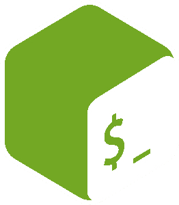
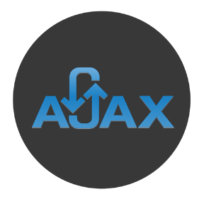
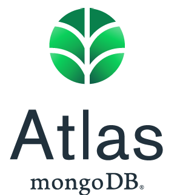

    
    <h1>Andrea Ren&eacute;
    </h1>

### Comtrya! I'm Andrea, a spirited Full Stack Developer and Teaching Assistant

I do have a [portfolio](https://andrearene.github.io/AndreaRene/), but here's the TLDR:

- 🌐 Passionate about web development and coding education.
- 👩‍🏫 Mentor and guide in a full stack development bootcamp.
- 🎓 Currently expanding knowlege working towards a certification in C#.
- 🖖 Sci-fi and fantasy enthusiast - lover of Star Trek, Harry Potter, and more.
- 🎮 Avid gamer and Disney fan, with a keen interest in anime, manga, and graphic novels.
- 🌟 Aspiring to transition into a developer role in an innovative company.
- 📚 Lifelong learner, constantly evolving and embracing new tech challenges.
- 💼 Open to collaborations and new opportunities. Let's connect!

## I did some pretty awesome stuff

- Certificate in full stack development through UT Austin.
- Earned at least 100% on all of the assignments and group projects.
- Certificate - Scientific Computing with Python through freecodecamp.org.
- Completing more certificate courses on freecodecamp.org.

Special note: I have a love-hate relationship with the challenges I completed to earn my Python certification. They really pushed, but looking back, I'm glad they did. I'm genuinely proud of the solutions I came up with. Call them a testament to both my stick-to-it-ive-ness and creativity. You can see them on my [Replit](https://replit.com/@AndreaRene)!

    
    

## I wrote some rants(articles) on LinkedIn

- [About confusing baby students with logics](https://www.linkedin.com/pulse/teaching-conditional-statements-real-challengeits-what-andrea-presto/)
- [About being a lazy coder](https://www.linkedin.com/pulse/im-lazy-i-know-confessions-from-flexbox-nester-andrea-presto/)
- [About how to play nice with others](https://www.linkedin.com/pulse/i-dont-get-git-why-you-yelling-me-version-control-andrea-presto/)
- [About cleaning up your code before you  can go play](https://www.linkedin.com/pulse/dry-code-what-i-mean-clean-clear-concise-andrea-presto/)

## May the list be ever growing

Here's a fun list of languages, frameworks, etc. I've learned to use for you to peruse:

    
    
    
    
    
    
    
    
    
    
    
    
    
    
    
    
    
    
    
    
    
    
    
    
    
    
    
    
    
    
    
    

### Still here?

Okay cool! Here's some numbers things:

        

        

Like these number things? Check out anuraghazra's repo: [Github Readme Stats](https://github.com/anuraghazra/github-readme-stats)
