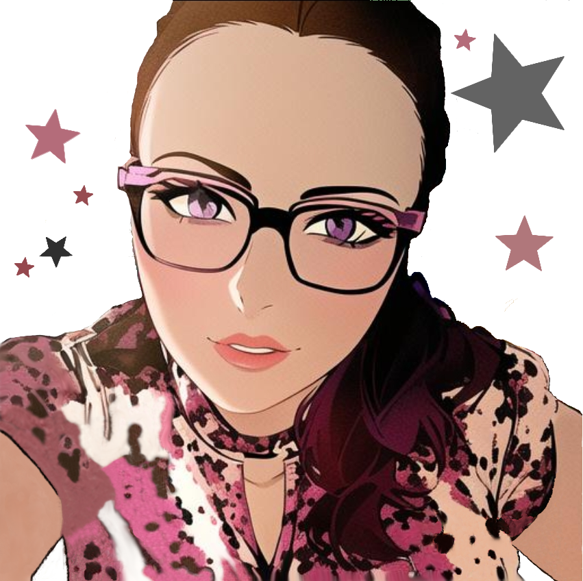

    
    <h1>Andrea Ren&eacute;
    </h1>

### Hello there! I'm Andrea, a spirited Full Stack Developer and Teaching Assistant.

I do have a professional portfolio, but here's the TLDR:

- 🌐 Passionate about web development and coding education.
- 👩‍🏫 Mentor and guide in a full stack development bootcamp.
- 🖖 Sci-fi and fantasy enthusiast - lover of Star Trek, Harry Potter, and more.
- 🎮 Avid gamer and Disney fan, with a keen interest in anime, manga, and graphic novels.
- 🌟 Aspiring to transition into a developer role in an innovative company.
- 📚 Lifelong learner, constantly evolving and embracing new tech challenges.
- 💼 Open to collaborations and new opportunities. Let's connect!